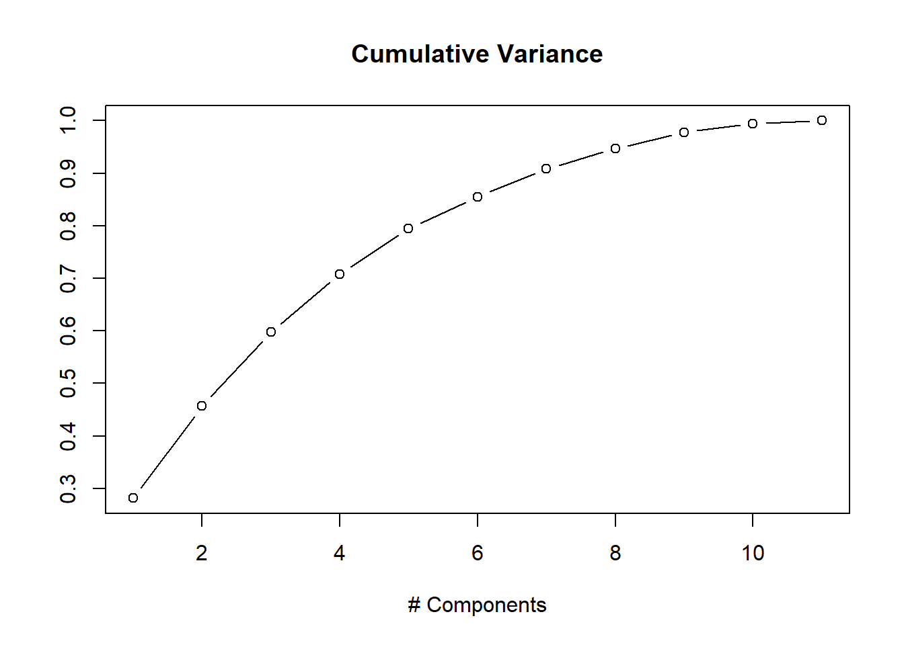
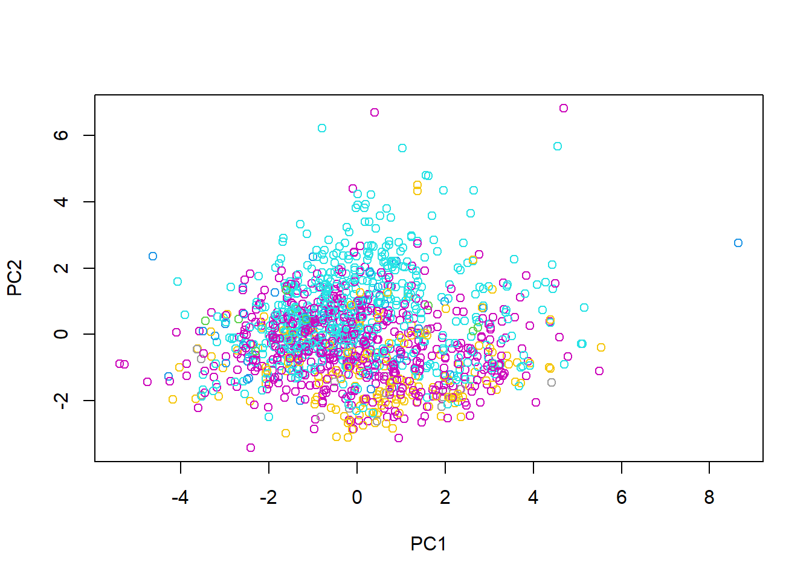

<!DOCTYPE html>
<!-- saved from url=(0029)file:///D:/git/README.md.html -->
<html><head><meta http-equiv="Content-Type" content="text/html; charset=UTF-8">

<meta name="generator" content="pandoc">
<meta http-equiv="X-UA-Compatible" content="IE=EDGE">

<!-- code folding -->

</head>

<body>

To compare the difference in mean vectors between red and white wine attributes, a hotelling’s two sample test was performed at significance level <nobr aria-hidden="true">α=0.05</nobr><math xmlns="http://www.w3.org/1998/Math/MathML"><mi>α</mi><mo>=</mo><mn>0.05</mn></math>. From the test, we obtained a p-value extremely less than the significance level and we reject the null that there is no difference in means between red and white wine. We have strong evidence that there is some difference between white and red wine.

<pre><code class="hljs">## Loading required package: robustbase</code></pre>
<pre><code class="hljs">## Scalable Robust Estimators with High Breakdown Point (version 1.6-0)</code></pre>
<pre><code class="hljs">##        T2         F 
## 40427.916  3669.606</code></pre>
<pre><code class="hljs">##  df1  df2 
##   11 6485</code></pre>
<pre><code class="hljs">## [1] 0</code></pre>

Looking at our coefficients after performing an lda, we can see that total sulfur dioxide contributes least to the separation of our data and density contributes the most. We can consider density, alcohol and residual sugar as attributes that differ the most between the groups.

<pre><code class="hljs">## Warning: package 'MASS' was built under R version 4.1.2</code></pre>
<pre><code class="hljs">##                              LD1
## fixed.acidity         0.87601571
## volatile.acidity      0.08834137
## citric.acid           0.12975009
## residual.sugar        1.52255637
## chlorides             0.06897438
## free.sulfur.dioxide  -0.08825867
## total.sulfur.dioxide  0.03751227
## density              -2.78342976
## pH                    0.46659009
## sulphates             0.22756565
## alcohol              -1.42548480</code></pre>

To classify the wine data, a quadratic discriminant analysis was done.QDA is a lot more flexible in comparison to LDA. It has similar computing time to LDA but has a better performance. While performing our classification, the test and training data was the same and from the classification table shown below, our apparent error rate is 11.12% and true classification rate is 88.87%.

<pre><code class="hljs">##      
## qda_p    1    2
##     1  984  108
##     2  615 4790</code></pre>
<pre><code class="hljs">## [1] 0.1112821</code></pre>

To cluster the data into 2 groups, a k means clustering was performed by taking the euclidean distance.As our number of clusters is already specified and only 2 clusters are needed, a kmeans seemed more suitable than hierarchical clustering. However, When comparing our clustered data with the original, only 54% of the data matched with the original.

<pre><code class="hljs">##      
## kclut    1    2
##     1   41  112
##     2 1558 4786</code></pre>
<pre><code class="hljs">## [1] 0.7429583</code></pre>

To compare difference in mean vectors between red wines with different quality scores, an MANOVA test is performed. There are six different types of red wines with quality measures 3,4,5,6,7 and 8. After performing a manova test, a p-value below 2.2e-16 was observed which leads use to reject the null hypothesis that there is no difference between the means.

<pre><code class="hljs">## Wilks' Lambda 
##     0.5496478</code></pre>
<pre><code class="hljs">## Chi2-Value         DF 
##   951.2801    55.0000</code></pre>
<pre><code class="hljs">## Wilks' Lambda 
##             0</code></pre>

Moreover, when the wins are groups into low(quality 3-4), medium(quality 5-6) and high(7-8), a p-value below 2.2e-16 is observed which leads use to again reject the null regarding the no difference in mean between the new groups.

<pre><code class="hljs">## Wilks' Lambda 
##     0.1242293</code></pre>
<pre><code class="hljs">## Chi2-Value         DF 
##   3318.231     22.000</code></pre>
<pre><code class="hljs">## Wilks' Lambda 
##             0</code></pre>

To classify the red wine data, k nearest neighbors was used. The data was scaled and 80% of it was taken for training and 20% for testing. From our confusion matrix, we got a moderate error rate of 41.87%.

<pre><code class="hljs">## Warning: package 'class' was built under R version 4.1.2</code></pre>
<pre><code class="hljs">##        
## red_knn   3   4   5   6   7   8
##       3   0   0   0   0   0   0
##       4   1   0   0   0   0   0
##       5   1   5 103  37   4   0
##       6   0   0  38  66  28   2
##       7   0   0   2  15  17   0
##       8   0   0   0   0   1   0</code></pre>
<pre><code class="hljs">## [1] 0.41875</code></pre>

The data was standardized before performing PCA. Looking at our data, there are variables are measured under different units and normalizaing them would produce data that is interpretable.

Using the first two principal components, a k nearest neighbors classifier was used. In comparison to our previous classification, the classification rate was lower. In the cumulative variance plot, we can see that the first two principal components only explain around 50% of the data. Therefore, using the first 2 PCs we obtain a poor performance rate.

<pre><code class="hljs">##       
## pc_knn   3   4   5   6   7   8
##      3   0   0   0   0   0   0
##      4   0   0   2   1   0   0
##      5   2  10 127  75  13   0
##      6   1   2  74 103  18   1
##      7   0   2  14  14  16   1
##      8   0   0   0   2   1   1</code></pre>
<pre><code class="hljs">## [1] 0.4854167</code></pre>

</body></html>
